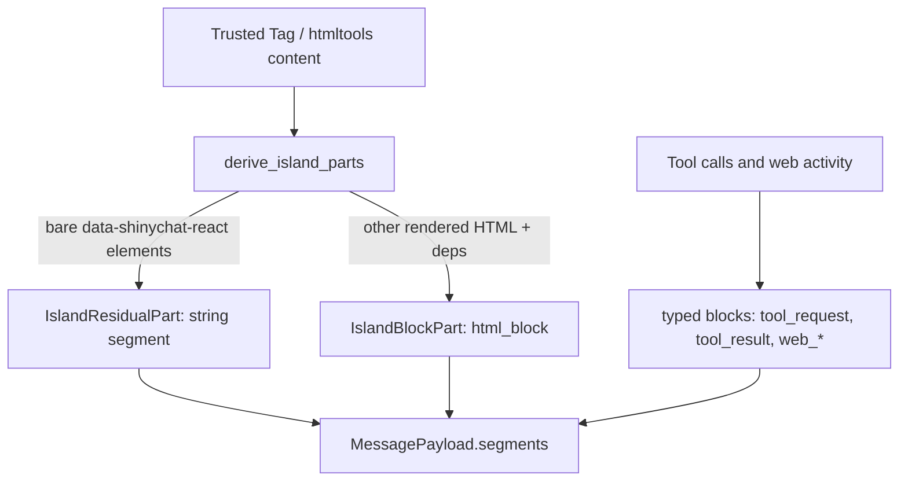
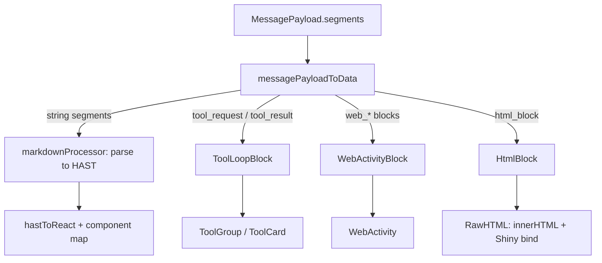

# Content Rendering

How chat message content flows from the server (Python/R) to the rendered DOM, and the design decisions that are easy to misunderstand. Read this to build the mental model; read the code for mechanism details.

## The Core Split: Two Content Channels

A message is an ordered list of **segments** of two kinds:

1. **String segments** (`markdown` / `html` / `text` / `thinking`) — flow through a markdown→HAST→React pipeline.
2. **Structured content blocks** (`tool_request`, `tool_result`, `web_search`, `web_search_results`, `web_fetch`, `html_block`) — typed JSON envelopes that bypass the HAST pipeline entirely and dispatch straight to React components.

The single most important design fact: **the envelope is the trust signal, not markup scanned out of the text channel**. Only the server can construct a structured block. Tool UI, web activity, and trusted raw HTML therefore cannot be instantiated by model output, which travels only in string segments. An earlier design embedded tool UI as markup (e.g. a `<shiny-tool-result value-type="html">` tag) inside content strings and scanned it back out on the client; a model could forge that tag in ordinary assistant markdown and reach the `innerHTML` sink unfiltered. Moving trust from scanned markup to server-constructed envelopes eliminated that XSS class *by construction* — there is nothing left in the text channel to forge.

## Lifecycle at a Glance

Server side — trusted content is partitioned into string segments and structured blocks, then serialized as `MessagePayload.segments`:

Client side — segments dispatch by kind: strings through the HAST pipeline, blocks straight to render-model components:

Key properties:

- **Streaming currently targets only string segments.** `chunk` actions append to string segments; structured blocks arrive complete, either inline in `message.segments` or mid-stream via a `block_insert` reducer action. This is the current state of the wire protocol, not a design constraint — a future streaming tool-call design (e.g. incrementally delivered `tool_request` arguments) would extend the protocol rather than fight it.
- **Display post-processing happens on the client.** The server sends an ungrouped, source-ordered stream of blocks; presentation concerns like grouping are computed on arrival, not pre-computed on the server. Adjacent `tool_request`/`tool_result` blocks merge into one `ToolLoopBlock`; adjacent `web_*` blocks merge into one `WebActivityBlock` (search↔results pair by adjacency). Whitespace-only string segments between carriers are tolerated; the group wrapper never appears on the wire.
- **Every block carries a `version` field** as a forward-compatibility marker: a client that predates a block's version warns and skips it rather than breaking the message around it. (All current block types are version 1; consult the wire types for the current numbers.)
- **`chunk` `operation="replace"` replaces everything.** A replace chunk wipes the entire in-flight message — string segments, thinking, and all structured blocks — then appends the new content. There is no per-block-type preservation; "replace means replace" was a deliberate decision to keep the semantics uniform and a future rework of the replace operation easy.

## Trust Boundaries

Three rules cover the whole system:

1. **Structured-block fields are server-attested.** HTML-bearing fields (`tool_result.value` with `value_type: "html"`, `title`/`icon`/`footer` on tool cards, `html_block.content`) render through the single audited `RawHTML` sink. Text fields (`intent`, `label`, `query`, `url`, …) are escaped. Code fields (`arguments`, `request_call`) render as markdown code blocks.
2. **String segments are never scanned for tool/web/island markup.** The untrusted component map (`untrustedChatTagToComponentMap`) resolves those tags to `EscapedIsland` (visible literal text) as defense in depth, and `markdownProcessor` unconditionally neutralizes the reserved island tags (`<shiny-chat-raw-html>`, legacy `<shinychat-raw-html>`) to inert text before the component map runs — so forged tags render as visible text even in trusted markdown.
3. **Role gate.** Non-`html_block` structured blocks in a user-role message are dropped with a warning. `html_block` is valid in any role (user messages can be server-authored with tags).

Per-segment trust still exists within the string channel: `ChatMessage` selects the trusted vs untrusted component map by `content_type`, and MarkdownStream carries `{text, trusted}` runs so a plain string in a mixed TagList can't inherit trust from an adjacent Tag.

One tool-specific invariant: `status: "running"` is never a wire value. The wire only knows `"success" | "error"`; the client derives "running" from an unpaired `tool_request` (a request with no matching `request_id` result yet).

## Restore: Re-Derive, Never Re-Parse

Persisted UI markup is never scanned for trust. Both servers re-derive structured blocks from stored **turns**: a `Turn` normalizes its contents into an ordered interleaving of string runs and blocks, and `StoredMessage.wire_segments()` re-interleaves them at the recorded positions so wire order matches source order. Python follows R's turns-based restore model; the R entry point is `chat_restore()`.

HTML dependencies follow a client-authoritative round-trip: the client renders deps on arrival *and* retains them per message (`ChatMessageData.htmlDeps`), reports them back in the settled-messages snapshot, and the server parks them on the stored segment so they can be re-registered on restore in a fresh browser session. (Python only; R has no equivalent round-trip.)

## Why RawHTML / innerHTML

`RawHTML` is the core primitive for HTML React must not own. React "owns" DOM nodes it renders; if it re-renders Shiny-bound content, `bindAll()` state is destroyed. The fix: a wrapper div rendered by React, whose children are injected via `ref` + `innerHTML` — invisible to the reconciler. Each `RawHTML` instance scopes its own `bindAll`/`unbindAll` (via `ShinyLifecycleContext`) to its element, replacing the old whole-message `ShinyBoundMarkdown` + throttle design. For `html_block` content it additionally handles `display: contents` and Shiny fill-layout participation, and deps render via `shiny.renderDependencies` before the HTML mounts (the `depsReady` gate).

## MarkdownStream Shares the Content Model

`MarkdownStream` (the `output_markdown_stream()` streaming-output widget) consumes the **same structured blocks and render-model components as Chat** — a deliberate alignment so a content-model update lands in one place, not two:

- **Wire**: the flat `shinyMarkdownStreamMessage` protocol gained an optional `block` field — a message carries `content` XOR `block` (Chat's envelope/action union was deliberately *not* adopted; MarkdownStream has no other action types to unify). Initial content's `content-segments` JSON is likewise a union of `{text, trusted}` runs and `{block}` entries. Replace/clear follows the same uniform replace semantics as Chat.
- **Client**: stream state is a union of string segments and render-model blocks (`StreamSegment = ContentSegment | HtmlBlock | WebActivityBlock`); blocks are hard structural boundaries between text runs, mirroring Chat's alternation invariant. Conversion reuses Chat's `asHtmlBlock` / `htmlBlockToRenderBlock` / `appendWebActivityBlock`, and rendering reuses `HtmlBlockContent`, `WebActivity`, and the aside components — no forked logic.
- **Scope**: `html_block` and `web_*` blocks are supported; inline asides work via the existing rehype pipeline and component map. **Tool blocks are intentionally not supported** in MarkdownStream (no use case for tool UI in arbitrary streaming output).

## The String-Segment Pipeline

String content is parsed by unified/rehype into HAST, then converted to React. Three frozen processors in `js/src/markdown/processors.ts`:

| Processor | Input | Notes |
|---|---|---|
| `markdownProcessor` | assistant markdown (trusted & untrusted) | GFM, raw-HTML parse, island-tag neutralization |
| `htmlProcessor` | trusted HTML string segments | greetings, residual trusted HTML in message content, `MarkdownStream(content_type="html")`; minimal processing: external links, uncontrolled inputs |
| `userMarkdownProcessor` | user input | HTML escaped/sanitized |

`MarkdownContent` splits rendering into a memoized parse stage (re-runs only on content/processor change) and a cheap HAST→React stage (re-runs when `streaming` toggles). `hastToReact()` maps tags to components (`pre`→`CopyableCodeBlock`, etc.); `passNode: true` hands mapped components the raw HAST node.

## Key Files

**Client (js/src/)**

| Area | File(s) |
|---|---|
| Wire types | `transport/types.ts` (`MessagePayload`, `SegmentPayload`) |
| Segment → render model | `chat/chat-entry.ts` (`messagePayloadToData`), `chat/state.ts` (`block_insert` case) |
| Tool blocks | `chat/tool-model.ts` (`structuredBlockToLoop`, `appendToolLoopBlock`, `regroupToolLoop`) |
| Web-activity blocks | `chat/web-activity-model.ts` (`asWebActivityWireBlock`, `applyWebBlock`, `appendWebActivityBlock`) |
| HTML blocks | `chat/html-block-model.ts` (`asHtmlBlock`, `htmlBlockToRenderBlock`), `chat/HtmlBlockContent.tsx` |
| Message rendering | `chat/ChatMessage.tsx`, `chat/chatTagToComponentMap.ts` (trusted vs untrusted maps) |
| innerHTML sink | `chat/RawHTML.tsx`, `chat/ShinyBindScope.tsx` |
| Markdown pipeline | `markdown/processors.ts`, `markdown/MarkdownContent.tsx`, `markdown/EscapedIsland.tsx`, `markdown/plugins/rehypeNeutralizeIslands.ts`, `markdown/plugins/rehypeUnwrapBlockCEs.ts` |
| Deps round-trip | `transport/shiny-transport.ts`, `chat/state.ts` (`buildMessagesSnapshot`) |
| MarkdownStream | `markdown-stream/MarkdownStream.tsx` (segment/block union state), `markdown-stream/markdown-stream-entry.ts` (flat wire protocol, `block` field) |

**Python (pkg-py/src/shinychat/)**

| Area | File(s) |
|---|---|
| Island partition | `_html_islands.py` (`derive_island_parts`) |
| Message construction | `_chat.py` (`ChatMessage`), `_markdown_stream.py` |
| Types / restore | `_chat_types.py` (`Turn`, `StoredMessage.wire_segments`), `_input_handler.py` (`messages_input_value`) |
| Normalization | `_chat_normalize*.py`, `_chat_segments.py` |

**R (pkg-r/R/)**

| Area | File(s) |
|---|---|
| Island partition | `html_islands.R` (`split_html_islands`) |
| Message construction | `chat.R`, `markdown-stream.R` |
| Restore | `chat_restore.R` |

## Design Boundaries

- **Block-level raw-HTML islands only.** `html_block` is block-level by design; there is no inline (within-paragraph) island form.
- **Asides/citations travel in the string channel** as `<shiny-aside>` markup with their own rehype pipeline (`rehypeGroupAsides`, `rehypeGroundedAsides`, `markTrailingAsides`). This is safe because asides are not an HTML-injection sink (React props + `isSafeUrl` only). The structured-block model deliberately leaves room for a future `AsideBlock` type — asides are interleaved inline within paragraphs and grounded-span matching searches the surrounding markdown, so any structured form needs a span identifier matched against sibling markdown segments rather than naive block dispatch.
- **Greetings are a flattened trusted HTML string** with `content_type: "html"` — no structured-block channel. They render through `htmlProcessor` and the trusted component map inside `ShinyBindScope`.

## Historical Notes (why things are the way they are)

- Island wrapper tags (`<shinychat-raw-html>`) once carried trusted HTML inside markdown, paying a parse→serialize→innerHTML HAST round-trip. Structured `html_block`s replaced them; the tags survive only as neutralized legacy input.
- Tool elements once traveled as `<shiny-tool-request>`/`<shiny-tool-result>` markup scanned out of content strings — the XSS class this design removes. The old adjacency grouping (`routeToolBlocks`, `WebActivity.parseItems`) is re-expressed on typed blocks with the same semantics.
- `rehypeUnwrapBlockCEs` still promotes block-level custom elements out of `
` wrappers for the remaining string-channel custom elements (asides, etc.).
