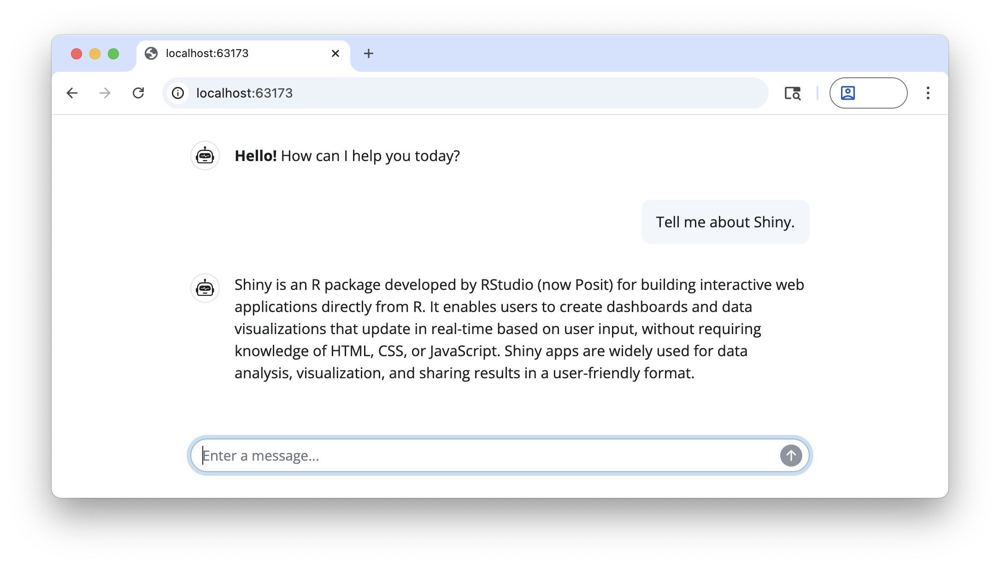

# shinychat <a href="https://posit-dev.github.io/shinychat/r/"></a>

<!-- badges: start -->
[](https://github.com/posit-dev/shinychat/actions/workflows/R-CMD-check.yaml)
[](https://CRAN.R-project.org/package=shinychat)
[](https://posit-dev.r-universe.dev/shinychat)
<!-- badges: end -->

**shinychat** provides a [Shiny](https://shiny.posit.co/) toolkit for building generative AI applications like chatbots and [streaming content](https://posit-dev.github.io/shinychat/r/reference/markdown_stream.html). It's designed to work alongside the [ellmer](https://ellmer.tidyverse.org/) package, which handles response generation.

## Installation

You can install shinychat from CRAN with:

``` r
install.packages("shinychat")
```

Or, install the development version of shinychat from [GitHub](https://github.com/) with:

``` r
# install.packages("pak")
pak::pak("posit-dev/shinychat/pkg-r")
```

## Example

To run this example, you'll first need to create an OpenAI API key, and set it in your environment as `OPENAI_API_KEY`.

You'll also need to install the [ellmer](https://ellmer.tidyverse.org/) package (with `install.packages("ellmer")`).

```r
library(shiny)
library(shinychat)

ui <- bslib::page_fillable(
  chat_ui(
    id = "chat",
    messages = "**Hello!** How can I help you today?"
  ),
  fillable_mobile = TRUE
)

server <- function(input, output, session) {
  chat <-
    ellmer::chat_openai(
      system_prompt = "Respond to the user as succinctly as possible."
    )

  observeEvent(input$chat_user_input, {
    stream <- chat$stream_async(input$chat_user_input)
    chat_append("chat", stream)
  })
}

shinyApp(ui, server)
```



## Next steps

Ready to start building a chatbot with shinychat? See [Get Started](https://posit-dev.github.io/shinychat/r/articles/get-started.html) to learn more.
