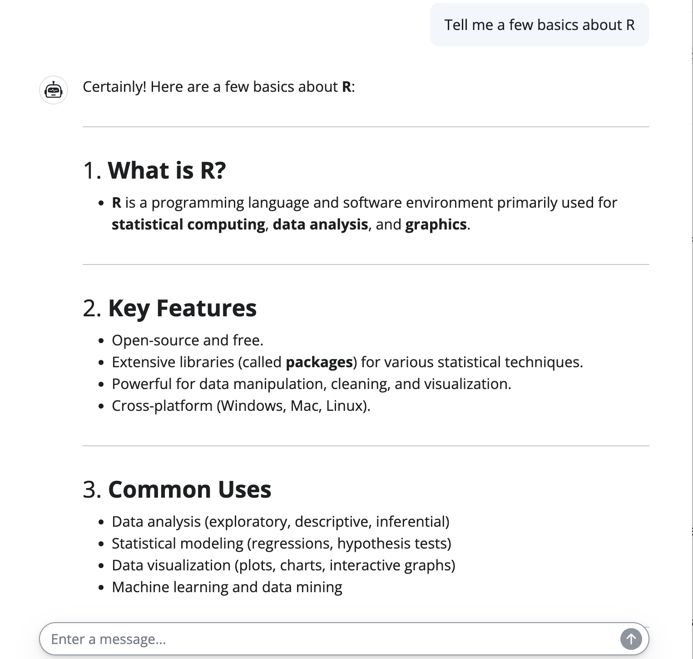
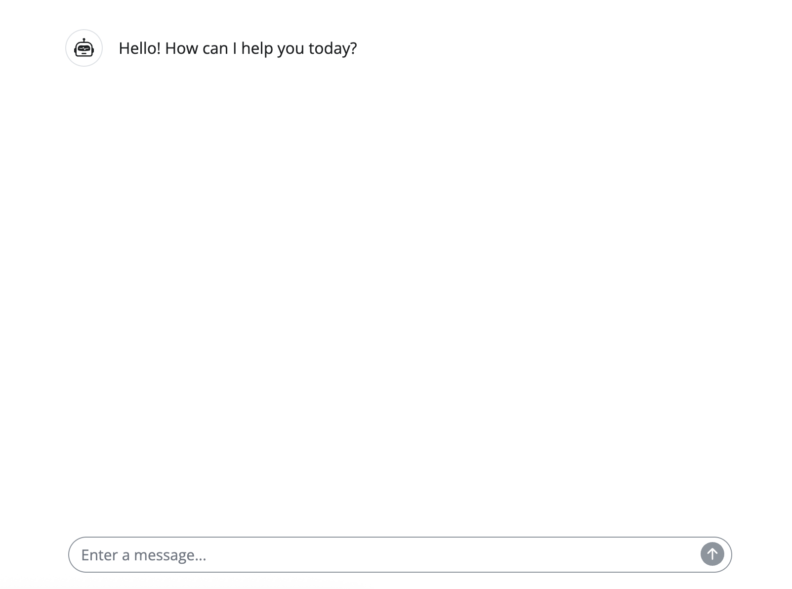
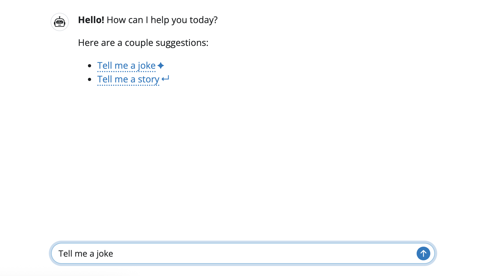
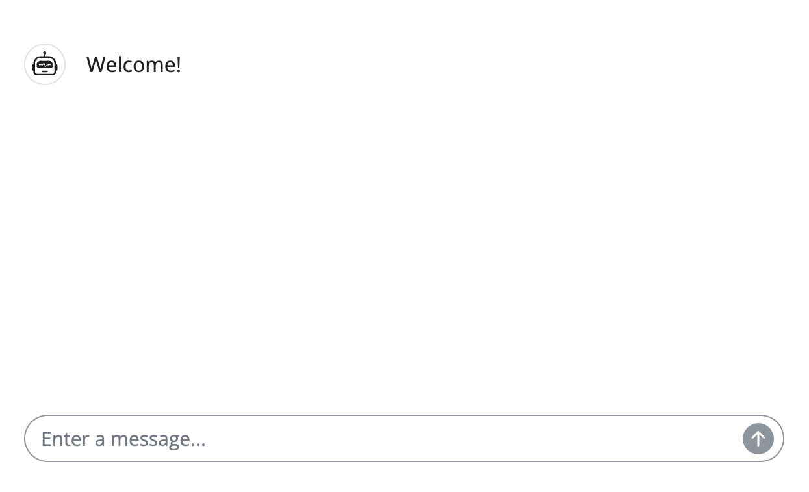
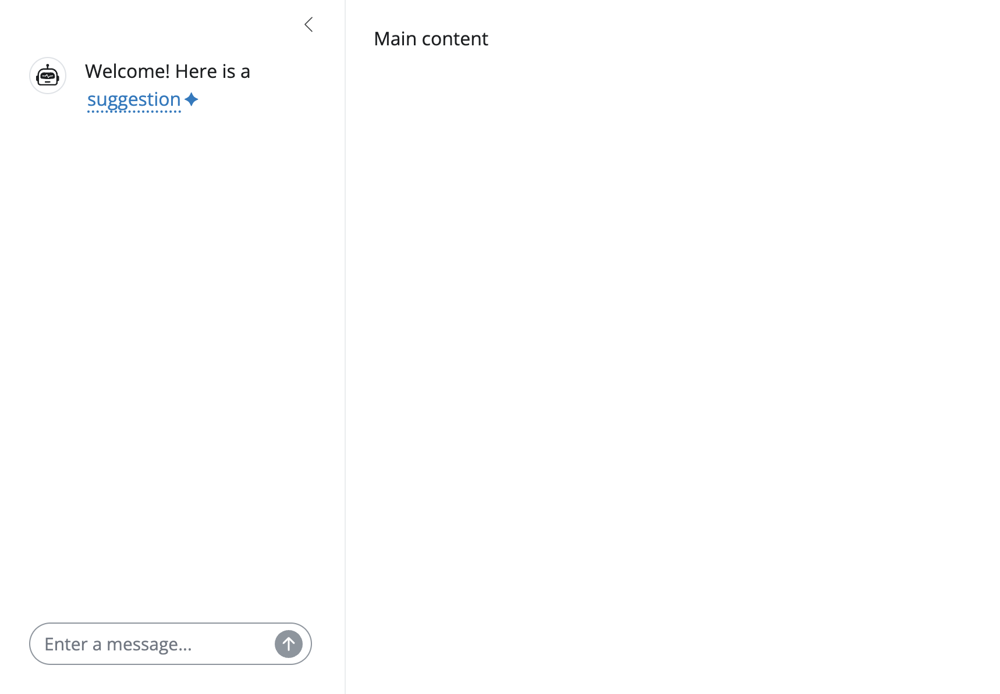
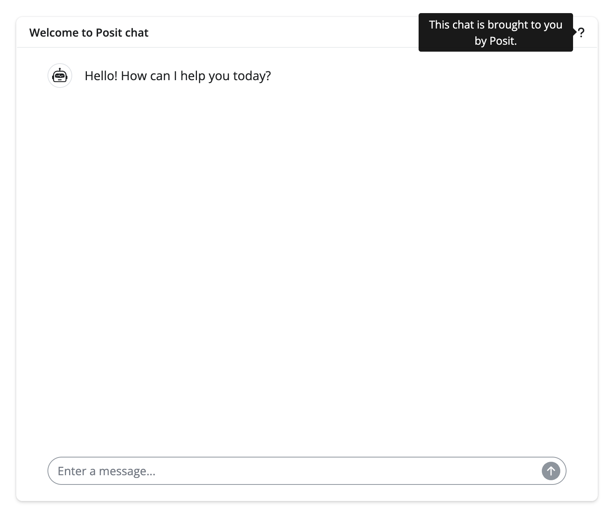

<style>
.callout {
  border: 1px solid #dfe1e5;
  border-left: 4px solid #2680e3;
  border-radius: 6px;
  background-color: var(--bs-body-bg, #fff);
  margin: 1em 0;
}

.callout > .title {
  background-color: #edf4fd;
  color: #1d1f21;
  padding: 0.5em 1em;
  font-weight: bold;
  border-bottom: 1px solid #dfe1e5;
}

.callout > .title::before {
  content: "ℹ️";
  margin-right: 0.5em;
}

.callout > .body {
  padding: 1em;
}

p.caption {
  text-align: center;
  font-size: 0.85em;
  color: #555;
  margin-top: 0.75em;
  margin-bottom: 1em;
}

img.rounded.shadow {
  display: block;
  margin-left: auto;
  margin-right: auto;
  border-radius: 0.5rem;
  box-shadow: 0 0.125rem 0.25rem rgba(0, 0, 0, 0.075);
}
</style>

```{r, include = FALSE}
knitr::opts_chunk$set(
  collapse = TRUE,
  comment = "#>"
)
```

```{r setup, echo=FALSE}
library(shinychat)
```

This article will cover how to build a chatbot powered by a Large Language Model (LLM) using shinychat and [ellmer](https://ellmer.tidyverse.org/). ellmer will handle connecting to and communicating with the model, while shinychat will handle the user interface for your chatbot. 

You will need to install both shinychat and ellmer. 

```r
install.packages(c("shinychat", "ellmer"))
```

## Setup

### Choose a model

First, choose a model to power your chatbot. ellmer and shinychat support a [wide variety](https://ellmer.tidyverse.org/#providers) of LLM providers including Anthropic, OpenAI, Vertex, Snowflake, Groq, Perplexity, and more.

With ellmer, you specify the LLM provider by choosing the corresponding `chat_*()` function, e.g., `chat_anthropic()`,  `chat_openai()`, etc. This makes it easy to swap out the chat provider to a different one at any time. 

Model providers also typically offer a variety of models. To specify a particular model, use the `chat_*()` function's `model` argument. For example:

```r
ellmer::chat_openai(model = "o3")
```

If you don't specify the `model` argument, the `chat_*()` function will use a reasonable default. For more information, see the individual `chat_*()` function's [documentation](https://ellmer.tidyverse.org/reference/index.html#chatbots). 

<div class="callout">
  <div class="title">Help me choose!</div>
  <div class="body">
If you're not sure which provider to choose, ellmer provides a [guide](https://ellmer.tidyverse.org/#providermodel-choice) to help you decide. 
  </div>
</div>

### Set up credentials

Next, authenticate with your LLM provider. Popular model providers like OpenAI and Anthropic require an API key. We recommend storing these API keys in your `.Renviron` (e.g., as `OPENAI_API_KEY` or `ANTHROPIC_API_KEY`).

You can find some helpful links and tips for getting set up with credentials (e.g., an API key) on the relevant reference page for the `chat_*()` provider you'd like to work with ([`chat_openai()`](https://ellmer.tidyverse.org/reference/chat_openai.html), [`chat_anthropic()`](https://ellmer.tidyverse.org/reference/chat_anthropic.html)).


## Create a basic chatbot

Once you've identified which model provider you want to use and set up the necessary credentials, you're ready to create a chatbot. The following code creates a basic chatbot in a Shiny app. 

Copy and paste the code into an R script, switching out `ellmer::chat_openai()` for your desired chat function. Save the file as `app.R` and then run the app.

```r
library(shiny)
library(shinychat)

ui <- bslib::page_fluid(
  chat_ui("chat")
)

server <- function(input, output, session) {
  chat <- ellmer::chat_openai()
  
  observeEvent(input$chat_user_input, {
    stream <- chat$stream_async(input$chat_user_input)
    chat_append("chat", stream)
  })
}

shinyApp(ui, server)
```

Congrats, you now have a chat interface powered by an LLM of your choice! 🎉

```{r, echo=FALSE, fig.cap="Screenshot of a conversation using shinychat.", fig.align='center', out.extra='class="rounded shadow"', out.height='50%'}

```

### Inspect the code

Let's take a closer look at the code in `app.R`. 

```r
library(shiny)
library(shinychat)

ui <- bslib::page_fluid(
  # Add a chat UI element
  chat_ui("chat")
)

server <- function(input, output, session) {
  # Initialize a chat with your chosen model provider
  chat <- ellmer::chat_openai(system_prompt = "You are a helpful assistant.")
  
  # Listen for user input and communicate with the model
  observeEvent(input$chat_user_input, {
    stream <- chat$stream_async(input$chat_user_input)
    chat_append("chat", stream)
  })
}

shinyApp(ui, server)
```

A shinychat chatbot includes three core steps:

1. **Create a chat UI element** with [`chat_ui()`](https://posit-dev.github.io/shinychat/reference/chat_ui.html).

2. **Initialize a chat** with a `chat_*()` function, like `chat_openai()`, in the server function. Use a different `chat_*()` function (`chat_ollama()`, `chat_anthropic()`, etc.) to use a different model provider. You can also use the `system_prompt` argument to supply a [system prompt](https://ellmer.tidyverse.org/articles/prompt-design.html). 

3. **Set up a reactive listener** with `observeEvent()` that waits for the user to submit a message (`input$chat_user_input`). When a message is received:

    * Send the input to the LLM using `chat$stream_async()`, which returns asynchronously streaming results from the LLM. This means the results will appear in chunks, so the user doesn’t have to wait for the full response.
    * Append the response to the `chat_ui()` element with `chat_append()`, so the user can see the model’s reply appear live as it's generated.

### Add a system prompt

Use the `chat_*()` function's `system_prompt` argument to provide the LLM with more information about how you would like it to behave. 

```r
chat <- ellmer::chat_ollama(system_prompt = "You are a helpful assistant")
```

To learn more about writing system prompts, see ellmer's [Prompt design](https://ellmer.tidyverse.org/articles/prompt-design.html) vignette. Generally, we recommend writing the system prompt in a separate markdown file, but if your prompt is short you can also supply it directly as a string to the `system_prompt` argument.

### Add messages and suggestions 

#### On startup

You can specify messages to show when the chat first loads by using `chat_ui()`'s `messages` argument. You can use markdown or HTML to format these messages.

```r
chat_ui(
    id = "chat",
    messages = "**Hello!** How can I help you today?"
)
```

```{r, echo=FALSE, fig.cap="Screenshot of a chatbot with a welcome message.", fig.align='center', out.extra='class="rounded shadow"', out.width='100%'}

```

You can also suggest inputs to the user by adding the `suggestion` CSS class to the relevant portions of the message. Similarly, use the `submit` class to make clicking on the suggestion submit the input automatically.

```r
messages <-
  '
  **Hello!** How can I help you today?

  Here are a couple suggestions:

  * <span class="suggestion">Tell me a joke</span>
  * <span class="suggestion submit">Tell me a story</span>
  '

ui <- bslib::page_fillable(
  chat_ui(
    id = "chat",
    messages = messages
  )
)
```

```{r, echo=FALSE, fig.cap="Screenshot of a chatbot with input suggestions.", fig.align='center', out.extra='class="rounded shadow"', out.width='100%'}

```

A markdown list (`<ul>` or `<ol>`) in which every item contains a single suggestion element is automatically rendered as a grid of clickable cards instead of inline chips. Each suggestion accepts an optional `title` attribute (plain text), which becomes the card heading; the suggestion's body becomes the card description. For ordered lists (`<ol>`), the list-item number is included in the heading.

Messages can also contain arbitrary Shiny UI [components](https://shiny.posit.co/r/components/), so you could even include something like a [tooltip](https://shiny.posit.co/r/components/display-messages/tooltips/) to provide additional details on demand.

#### Mid-conversation

You can also use suggestions to guide users through a multi-turn conversation. To do so, you’ll need to instruct the AI how to generate suggestions itself by adding a section like the one below to your system prompt:

````
## Showing prompt suggestions

If you find it appropriate to suggest prompts the user might want to write, wrap the text of each prompt in `<span class="suggestion">` tags.
Also use "Suggested next steps:" to introduce the suggestions. For example:

```
Suggested next steps:

1. <span class="suggestion">Suggestion 1.</span>
2. <span class="suggestion">Suggestion 2.</span>
3. <span class="suggestion">Suggestion 3.</span>
```
````

## Layouts

### Screen-filling layout

Use [`page_fillable()`](https://rstudio.github.io/bslib/reference/page_fillable.html) with `fillable_mobile = TRUE` if you want the chatbot input to stay anchored at the bottom of the page and the chat to fill the remaining space.

```r
ui <- bslib::page_fillable(
  chat_ui("chat", messages = "Welcome!"),
  fillable_mobile = TRUE
)
```

```{r, echo=FALSE, fig.cap="Screenshot of a chatbot filling the page.", fig.align='center', out.extra='class="rounded shadow"', out.width='100%'}

```

### Sidebar layout

It can also be useful to place the chat in a sidebar, to free up the main panel for other components. Use [`page_sidebar()`](https://rstudio.github.io/bslib/reference/page_sidebar.html) to create a sidebar page. Then, set the chat and sidebar's heights to `100%` so that the chat element fills the sidebar.

```r
library(shiny)
library(bslib)
library(shinychat)

ui <- bslib::page_sidebar(
  sidebar = sidebar(
    chat_ui(
      "chat",
      messages = list(
        "Welcome! Here is a <span class='suggestion'>suggestion</span>."
      ),
      height = "100%"
    ),
    width = 300,
    style = "height: 100%;"
  ),
  "Main content",
  fillable = TRUE
)

server <- function(input, output, session) {
  chat <- ellmer::chat_openai()
  
  observeEvent(input$chat_user_input, {
    stream <- chat$stream_async(input$chat_user_input)
    chat_append("chat", stream)
  })
}

shinyApp(ui, server)
```
```{r, echo=FALSE, fig.cap="Screenshot of a chatbot filling a sidebar.", fig.align='center', out.extra='class="rounded shadow"', out.width='100%'}

```

### Card layout

Embedding the chat component inside a `card()` can help visually separate the chat from the rest of the app. You can also add a card header to include more information about your chatbot (perhaps with a [tooltip](https://shiny.posit.co/r/components/display-messages/tooltips/)).

[Cards](https://rstudio.github.io/bslib/articles/cards/) also come with other handy features like `full_screen = TRUE` to make the chat full-screen when embedded inside a larger app.

```r
library(shiny)
library(bslib)
library(shinychat)

ui <- page_fillable(
  card(
    card_header(
      "Welcome to Posit chat",
      tooltip(icon("question"), "This chat is brought to you by Posit."),
      class = "d-flex justify-content-between align-items-center"
    ),
    chat_ui(
      id = "chat",
      messages = "Hello! How can I help you today?"
    )
  ),
  fillable_mobile = TRUE
)

server <- function(input, output, session) {
  chat <- ellmer::chat_openai()
  
  observeEvent(input$chat_user_input, {
    stream <- chat$stream_async(input$chat_user_input)
    chat_append("chat", stream)
  })
}

shinyApp(ui, server)
```

```{r, echo=FALSE, fig.cap="Screenshot of a chatbot embedded in a card with a header and tooltip.", fig.align='center', out.extra='class="rounded shadow"', out.width='100%'}

```

## Slash commands

Slash commands give users discoverable shortcuts — like `/search`, `/clear`, or `/help` — that run a handler you define on the server. Register commands on the object returned by `chat_server()`, using its `slash_command()` method. When a user runs a command, its handler fires instead of the text being sent to the model, and what happens next is entirely up to the handler.

The two most common patterns are **prompt expansion** — where the command transforms the user's input before sending it to the LLM — and **side effects** — where the command performs an action without involving the LLM at all.

### Prompt expansion

The most common use of slash commands is giving users a shortcut that sends a prompt to the model on their behalf. A handler that takes one argument receives a `ContentSlashCommand` object — not a plain string. This object carries the command name, the text typed after it, and a `text` property that controls what the LLM sees. For `/search shiny modules`:

- `content@command` is `"search"`
- `content@user_text` is `"shiny modules"`
- `content@text` starts as a descriptive default — set it to your expanded prompt

For example, a `/search` command could enrich the user's query with retrieved context before streaming the model's answer. In a real app the retrieval step would query a vector store or search index (i.e., a RAG workflow), but the core pattern is the same:

```r
library(shiny)
library(bslib)
library(shinychat)

ui <- page_fillable(
  chat_ui("chat", placeholder = "Type / for commands, or chat away...")
)

server <- function(input, output, session) {
  client <- ellmer::chat_openai(system_prompt = "You are a helpful assistant.")
  chat <- chat_server("chat", client = client)

  chat$slash_command("search", "Search the docs", function(content) {
    # In practice, retrieve relevant documents here (e.g., via a vector DB)
    content@text <- paste(
      "Search the documentation for the following topic and provide a concise summary:",
      content@user_text
    )
    stream <- client$stream(content)
    chat_append("chat", stream)
  })
}

shinyApp(ui, server)
```

When the user types `/search shiny modules`, the handler sets the expanded prompt as `content@text` and streams the model's response. The user sees `/search shiny modules` as their message; the LLM receives the expanded prompt. Because `ContentSlashCommand` extends `ellmer::ContentText`, it works anywhere a `ContentText` does — the LLM reads the `text` property, while the chat UI preserves the original command for bookmark restore.

### Side effects

Some commands perform an action without involving the LLM — clearing the conversation, opening a help modal, exporting a transcript. Pass `echo = FALSE` so the command doesn't appear as a user message:

```r
chat$slash_command("clear", "Clear the conversation", function() {
  chat$clear()
}, echo = FALSE)
```

### Client-side handlers

Pass `NULL` as the handler to register a command that appears in the palette
but is handled entirely in the browser. Listen for the `shiny:chat-slash-command`
event and call `preventDefault()`:

```r
chat$slash_command("clear", "Clear the input", NULL)

tags$script(HTML("
  document.addEventListener('shiny:chat-slash-command', function(e) {
    if (e.detail.id !== 'chat' || e.detail.command !== 'clear') return;
    e.preventDefault();
    document.querySelector('#chat-chat textarea').value = '';
  });
"))
```

The event is cancelable and bubbles. Use `e.detail.id` to target a specific chat. `preventDefault()` skips the server round-trip; set `e.detail.echo` to control whether the command appears as a user message.

### Key points

- Users type `/` to open a palette of registered commands; arrow keys navigate, Enter or Tab selects, Escape dismisses.
- A slash command's handler fires instead of sending the text to the model. What happens next — including whether anything reaches the LLM — is entirely up to your handler.
- A `/` message that doesn't match any registered command is sent as an ordinary message.
- Handlers take 0 or 1 argument. A 1-argument handler receives a `ContentSlashCommand` object (an `ellmer::ContentText` subclass) whose `user_text` and `text` properties let you control what the LLM sees while preserving the original command for display on bookmark restore.
- The `echo` argument controls whether invoking the command appears as a user message. Defaults to `TRUE` with a handler. Pass `echo = FALSE` for side-effect-only handlers.
- `slash_command()` returns a function that removes the command when called. Re-registering an existing name raises an error unless you pass `force = TRUE`.
- Slash command messages are restored faithfully when a bookmarked app is reopened.

Slash commands are currently available only through `chat_server()`, not when building a fully custom chat loop with `chat_ui()` and `chat_append()` directly.

## Stream cancellation

shinychat supports cancelling an in-progress AI response. When cancellation is enabled, a stop button appears in the chat input area during streaming. Users can also press Escape while the chat has focus to cancel the current response. Any partial response already received is preserved in the chat history.

### Using `chat_server()` (recommended)

Pass `enable_cancel = TRUE` to `chat_ui()` and `chat_server()` handles everything automatically — the stop button is shown during streaming and the cancel input is wired up internally.

```r
library(shiny)
library(bslib)
library(shinychat)
library(ellmer)

ui <- page_fillable(
  chat_ui("chat", enable_cancel = TRUE)
)

server <- function(input, output, session) {
  chat <- chat_anthropic(system_prompt = "You are a helpful assistant.")
  chat_server("chat", client = chat)
}

shinyApp(ui, server)
```

### Manual approach

If you are building a fully custom chat loop with `chat_ui()` and `chat_append()` directly, you can wire up cancellation yourself.

The key steps are:

1. Pass `enable_cancel = TRUE` to `chat_ui()` to show the stop button during streaming.
2. Create an `ellmer::stream_controller()` and pass it to `chat$stream_async()` via the `controller` argument. The controller automatically resets between streams, so you only need to create it once.
3. Observe `input$<id>_cancel` (where `<id>` is your chat element's ID) and call `ctrl$cancel()` when it fires.

```r
ui <- page_fillable(
  chat_ui("chat", enable_cancel = TRUE)
)

server <- function(input, output, session) {
  chat <- ellmer::chat_openai(system_prompt = "You are a helpful assistant.")
  ctrl <- ellmer::stream_controller()

  chat_task <- ExtendedTask$new(function(user_input, controller) {
    stream <- chat$stream_async(
      user_input,
      stream = "content",
      controller = controller
    )
    p <- promises::promise_resolve(stream)
    promises::then(p, function(stream) {
      chat_append("chat", stream)
    })
  })

  observeEvent(input$chat_user_input, {
    chat_task$invoke(input$chat_user_input, controller = ctrl)
  })

  observeEvent(input$chat_cancel, {
    ctrl$cancel()
  })
}

shinyApp(ui, server)
```

## File attachments

shinychat supports file attachments, allowing users to upload images, PDFs, and text files alongside their messages. When attachments are enabled, the chat input shows a file picker button and also accepts drag-and-drop or clipboard paste.

### Using `chat_server()` (recommended)

Pass `allow_attachments = TRUE` to `chat_ui()` and `chat_server()` handles the rest — uploaded files are automatically converted to ellmer content objects and sent to the model.

```r
library(shiny)
library(bslib)
library(shinychat)
library(ellmer)

ui <- page_fillable(
  chat_ui("chat", allow_attachments = TRUE)
)

server <- function(input, output, session) {
  chat <- chat_anthropic(system_prompt = "You are a helpful assistant.")
  chat_server("chat", client = chat)
}

shinyApp(ui, server)
```

### Manual approach

If you are building a custom chat UI with `chat_ui()` directly, enable attachments by setting `allow_attachments = TRUE`. This changes the shape of `input$<id>_user_input` from a plain character string to a list of ellmer `Content` objects. Use the splice operator (`!!!`) to pass these content objects to the chat client.

```r
ui <- page_fillable(
  chat_ui("chat", allow_attachments = TRUE)
)

server <- function(input, output, session) {
  chat <- ellmer::chat_openai(system_prompt = "You are a helpful assistant.")

  observeEvent(input$chat_user_input, {
    stream <- chat$stream_async(!!!input$chat_user_input)
    chat_append("chat", stream)
  })
}

shinyApp(ui, server)
```

Key points:

- Pass `allow_attachments = TRUE` to `chat_ui()` to show the file picker button. You can also pass a character vector of MIME types (e.g. `c("image/png", "image/jpeg")`) to restrict accepted file types.
- When `allow_attachments` is enabled, `input$<id>_user_input` is always a list of ellmer `Content` objects (text first, then one content object per attachment), even when no files are attached. Use `!!!` to splice the list into `stream_async()`.
- The maximum combined attachment size defaults to approximately 30 MB and can be configured via the `SHINYCHAT_MAX_ATTACHMENT_SIZE` environment variable.
