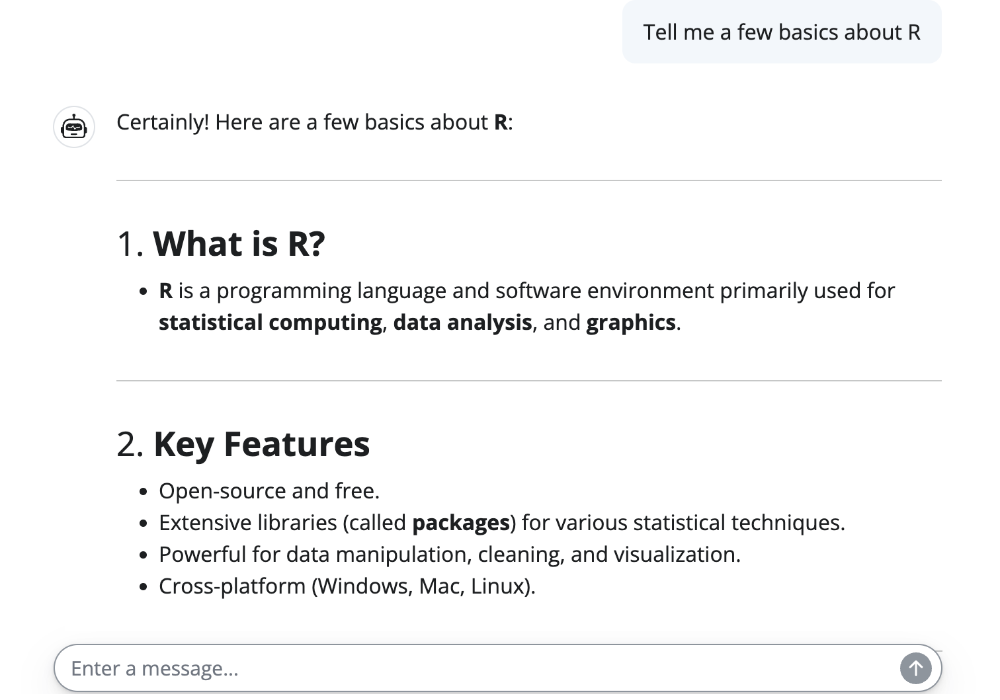
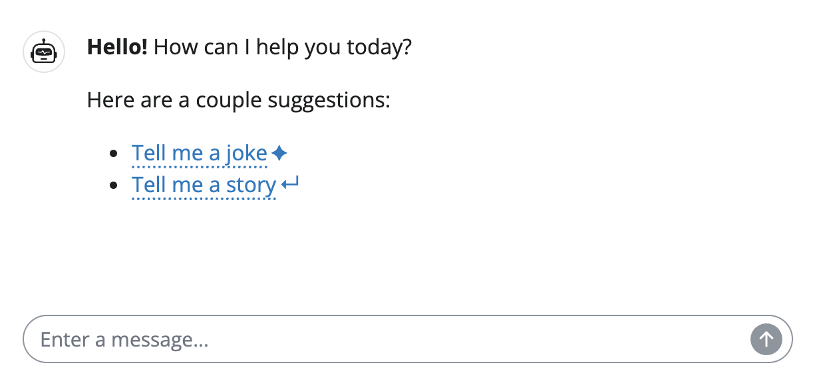
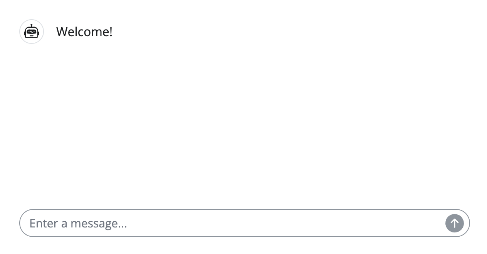

```{r, include = FALSE}
knitr::opts_chunk$set(
  collapse = TRUE,
  comment = "#>"
)
```

```{r setup}
library(shinychat)
```

This article will cover how to build a chatbot powered by a Large Language Model (LLM) using shinychat and [ellmer](https://ellmer.tidyverse.org/). ellmer will handle connecting to and communicating with the model, while shinychat will handle the user interface for your chatbot. 

You will need to install both shinychat and ellmer. 

```r
install.packages(c("shinychat", "ellmer"))
```

## Setup

### Choose a model

First, choose a model to power your chatbot. ellmer and shinychat support a [wide variety](https://ellmer.tidyverse.org/#providers) of LLM providers including Anthropic, OpenAI, Vertex, Snowflake, Groq, Perplexity, and more.

With ellmer, you specify the LLM provider by choosing the corresponding `chat_*()` function, e.g., `chat_anthropic()`,  `chat_openai()`, etc. This makes it easy to swap out the chat provider to a different one at any time. 

Model providers also typically offer a variety of models. To specify a particular model, use the `chat_*()` function's `model` argument. For example:

```r
chat_openai(model = "o3")
```

If you don't specify the `model` argument, the `chat_*()` function will use a reasonable default. For more information, see the individual `chat_*()` function's [documentation](https://ellmer.tidyverse.org/reference/index.html#chatbots). 


::: callout-tip
## Help me choose!
If you're not sure which provider to choose, ellmer provides a [guide](https://ellmer.tidyverse.org/#providermodel-choice) to help you decide. 

If you’re not ready to sign up for a cloud provider (e.g., OpenAI or Anthropic), you can run models locally (for free!) with [Ollama](https://ellmer.tidyverse.org/reference/chat_ollama.html).

A local model is a good way to get started without incurring any cost or sharing your data with a cloud provider. You will need to [install Ollama](https://ellmer.tidyverse.org/reference/chat_ollama.html) and an open-source model (e.g., Llama 3.1). You can use the [`ollamar` package](https://hauselin.github.io/ollama-r/) to install particular models from R. 
:::

### Set up credentials

Next, authenticate with your LLM provider. Popular model providers like OpenAI and Anthropic require an API key. We recommend storing these API keys in your `.Renviron` (e.g., as `OPENAI_API_KEY` or `ANTHROPIC_API_KEY`).

You can find the variable names in each `chat_*()` function's documentation (e.g., [`chat_openai()`](https://ellmer.tidyverse.org/reference/chat_openai.html#arg-api-key), [`chat_anthropic()`](https://ellmer.tidyverse.org/reference/chat_anthropic.html#arg-api-key)). There is additional information on [authentication](https://ellmer.tidyverse.org/#authentication) on the ellmer site.

Once your credentials (if any) are in place, you're ready to get started. 

## Create a basic chatbot

Once you've identified which model provider you want to use and set up the necessary authentication, you're ready to create a chatbot. The following code creates a basic chatbot in a Shiny app. 

Copy and paste the code into an R script, switching out `ellmer::chat_openai()` for your desired chat function. Save the file as `app.R` and then run the app.

```r
library(shiny)
library(shinychat)

ui <- bslib::page_fluid(
  chat_ui("chat")
)

server <- function(input, output, session) {
  chat <- ellmer::chat_openai()
  
  observeEvent(input$chat_user_input, {
    stream <- chat$stream_async(input$chat_user_input)
    chat_append("chat", stream)
  })
}

shinyApp(ui, server)
```

Congrats, you now have a chat interface powered by an LLM of your choice! 🎉

{class="rounded shadow lightbox mt-3"}


### Inspect the code

Let's take a closer look at the code in `app.R`. 

```r
library(shiny)
library(shinychat)

ui <- bslib::page_fluid(
  # Add a chat UI element
  chat_ui("chat")
)

server <- function(input, output, session) {
  # Initialize a chat with your chosen model provider
  chat <- ellmer::chat_openai(system_prompt = "You are a helpful assistant.")
  
  # Listen for user input and communicate with the model
  observeEvent(input$chat_user_input, {
    stream <- chat$stream_async(input$chat_user_input)
    chat_append("chat", stream)
  })
}

shinyApp(ui, server)
```

A shinychat chatbot includes three core steps:

1. **Create a chat UI element** with [`chat_ui()`](https://posit-dev.github.io/shinychat/reference/chat_ui.html).

2. **Initialize a chat** with a `chat_*()` function, like `chat_openai()`, in the server function. You can use the `system_prompt` argument to supply a [system prompt](https://ellmer.tidyverse.org/articles/prompt-design.html).

3. **Set up a reactive listener** with `observeEvent()` that waits for the user to submit a message (`input$chat_user_input`). When a message is received:

    * Send the input to the LLM using `chat$stream_async()`, which returns asynchronously streaming results from the LLM. This means the results will appear in chunks, so the user doesn’t have to wait for the full response.
    * Append the response to the `chat_ui()` element with `chat_append()`, so the user can see the model’s reply appear live as it's generated.

### Switch the model

To switch the model provider, use a different `chat_*()` function.

```r
library(shiny)
library(shinychat)

ui <- bslib::page_fluid(
  chat_ui("chat")
)

server <- function(input, output, session) {
  # Switch this chat_*() function to use a different model provider
  chat <- ellmer::chat_ollama(system_prompt = "You are a helpful assistant.")
  
  observeEvent(input$chat_user_input, {
    stream <- chat$stream_async(input$chat_user_input)
    chat_append("chat", stream)
  })
}

shinyApp(ui, server)
```

### Add a system prompt

Use the `chat_*()` function's `system_prompt` argument to provide the LLM with more information about how you would like it to behave. 

```r
chat <- ellmer::chat_ollama(system_prompt = "You are a helpful assistant")
```

To learn more about writing system prompts, see ellmer's [Prompt design](https://ellmer.tidyverse.org/articles/prompt-design.html) vignette. Generally, we recommend writing the system prompt in a separate markdown file, but if your prompt is short you can also supply it directly as a string to the `system_prompt` argument.

### Add messages and suggestions on startup

You can specify messages to show when the chat first loads by using `chat_ui()`'s `messages` argument. You can use markdown or HTML to format these messages.

```r
chat_ui(
    id = "chat",
    messages = "**Hello!** How can I help you today?"
)
```

{class="rounded shadow lightbox d-block m-auto"}

You can also suggest inputs to the user by adding the `suggestion` CSS class to the relevant portions of the message. Similarly, use the `submit` class to make the clicking on the suggestion submit the input automatically.

```r
messages <-
  '
  **Hello!** How can I help you today?

  Here are a couple suggestions:

  * <span class="suggestion">Tell me a joke</span>
  * <span class="suggestion submit">Tell me a story</span>
  '

ui <- bslib::page_fillable(
  chat_ui(
    id = "chat",
    messages = messages
  )
)
```

{class="rounded shadow lightbox d-block m-auto"}

Messages can also contain arbitrary Shiny UI [components](https://shiny.posit.co/r/components/), so you could even include something like a [tooltip](https://shiny.posit.co/r/components/display-messages/tooltips/) to provide additional details on demand.

## Layouts

### Screen-filling layout

Use [`page_fillable()`](https://rstudio.github.io/bslib/reference/page_fillable.html) with `fillable_mobile = TRUE` if you want the chatbot input to stay anchored at the bottom of the page and the chat to fill the remaining space.

```r
ui <- bslib::page_fillable(
  chat_ui("chat", messages = "Welcome!"),
  fillable_mobile = TRUE
)
```

{class="rounded shadow lightbox d-block m-auto"}

### Sidebar layout

It can also be useful to place the chat in a sidebar, to free up the main panel for other components. Use [`page_sidebar()`](https://rstudio.github.io/bslib/reference/page_sidebar.html) to create a sidebar page. Then, set the chat and sidebar's heights to `100%` so that the chat element fills the sidebar.

```r
library(shiny)
library(bslib)
library(shinychat)

ui <- bslib::page_sidebar(
  sidebar = sidebar(
    chat_ui(
      "chat",
      messages = list(
        "Welcome! Here is a <span class='suggestion'>suggestion</span>"
      ),
      height = "100%"
    ),
    width = 300,
    style = "height: 100%;"
  ),
  "Main content",
  fillable = TRUE
)

server <- function(input, output, session) {
  chat <- ellmer::chat_openai()
  
  observeEvent(input$chat_user_input, {
    stream <- chat$stream_async(input$chat_user_input)
    chat_append("chat", stream)
  })
}

shinyApp(ui, server)
```

{class="rounded shadow lightbox d-block m-auto"}

### Card layout

Embedding the chat component inside a `card()` can help visually separate the chat from the rest of the app. You can also add a card header to include more information about your chatbot (perhaps with a [tooltip](https://shiny.posit.co/r/components/display-messages/tooltips/)).

[Cards](https://rstudio.github.io/bslib/articles/cards/) also come with other handy features like `full_screen = TRUE` to make the chat full-screen when embedded inside a larger app.

```r
library(shiny)
library(bslib)
library(shinychat)

ui <- page_fillable(
  card(
    card_header(
      "Welcome to Posit chat",
      tooltip(icon("question"), "This chat is brought to you by Posit."),
      class = "d-flex justify-content-between align-items-center"
    ),
    chat_ui(
      id = "chat",
      messages = "Hello! How can I help you today?"
    )
  ),
  fillable_mobile = TRUE
)

server <- function(input, output, session) {
  chat <- ellmer::chat_openai()
  
  observeEvent(input$chat_user_input, {
    stream <- chat$stream_async(input$chat_user_input)
    chat_append("chat", stream)
  })
}

shinyApp(ui, server)
```


{class="rounded shadow lightbox d-block m-auto"}
