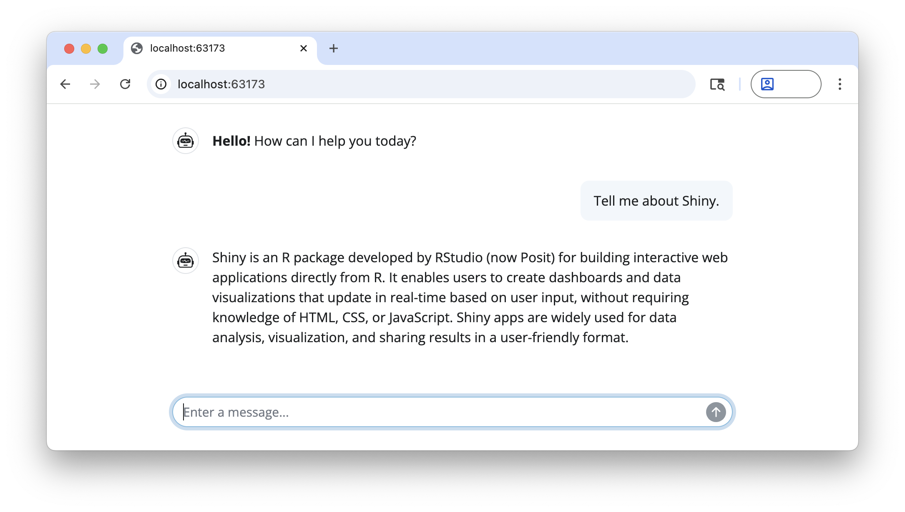

# shinychat

**shinychat** provides a [Shiny](https://shiny.posit.co/) toolkit for
building generative AI applications like chatbots and [streaming
content](https://posit-dev.github.io/shinychat/r/reference/markdown_stream.html).
It’s designed to work alongside the
[ellmer](https://ellmer.tidyverse.org/) package, which handles response
generation.

## Installation

You can install shinychat from CRAN with:

``` r

install.packages("shinychat")
```

Or, install the development version of shinychat from
[GitHub](https://github.com/) with:

``` r

# install.packages("pak")
pak::pak("posit-dev/shinychat/pkg-r")
```

## Example

To run this example, you’ll first need to create an OpenAI API key, and
set it in your environment as `OPENAI_API_KEY`.

You’ll also need to install the [ellmer](https://ellmer.tidyverse.org/)
package (with `install.packages("ellmer")`).

``` r

library(shiny)
library(shinychat)

ui <- page_chat(
  "Assistant",
  id = "chat",
  messages = "**Hello!** How can I help you today?"
)

server <- function(input, output, session) {
  chat <-
    ellmer::chat_openai(
      system_prompt = "Respond to the user as succinctly as possible."
    )

  observeEvent(input$chat_user_input, {
    stream <- chat$stream_async(input$chat_user_input)
    chat_append("chat", stream)
  })
}

shinyApp(ui, server)
```



## Next steps

Ready to start building a chatbot with shinychat? See [Get
Started](https://posit-dev.github.io/shinychat/r/articles/get-started.html)
to learn more.

Use
[`page_chat()`](https://posit-dev.github.io/shinychat/r/dev/reference/page_chat.md)
when the chat owns the full browser window. It includes responsive
navigation and sidebar support:

``` r

ui <- page_chat(
  "Assistant",
  toolbar = actionButton("clear_chat", "Clear conversation"),
  toolbar_global = bslib::toolbar(
    bslib::input_dark_mode(),
    actionButton("help", "Help")
  ),
  sidebar = chat_sidebar(tags$p("Tools"), history = FALSE),
  pages_navbar = list(
    chat_nav_panel(
      "About",
      tags$p("About this app."),
      value = "about",
    ),
    chat_nav_panel(
      "Settings",
      tags$p("Settings"),
      toolbar = actionButton("save_settings", "Save settings")
    )
  ),
  drawer = chat_drawer(tags$p("Preview content"), title = "Preview")
)
```

For an embedded chat or a layout with other top-level content, continue
using
[`chat_ui()`](https://posit-dev.github.io/shinychat/r/dev/reference/chat_ui.md)
inside
[`bslib::page_fillable()`](https://rstudio.github.io/bslib/reference/page_fillable.html),
[`bslib::page_sidebar()`](https://rstudio.github.io/bslib/reference/page_sidebar.html),
or another suitable container.
[`page_chat()`](https://posit-dev.github.io/shinychat/r/dev/reference/page_chat.md)
owns its page composition and should not be wrapped in another page
container.

The package includes credential-free
[`page_chat()`](https://posit-dev.github.io/shinychat/r/dev/reference/page_chat.md)
examples. Run them with:

``` r

shiny::runExample("page-chat-navigation", package = "shinychat")
shiny::runExample("page-chat-drawer-controls", package = "shinychat")
```
